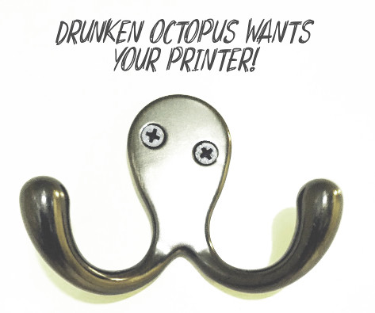

# Introduction

*Drunken Octopus* Marlin: An Alternative (Unofficial) Firmware for AlephObjects Printers

## Who can benefit from *Drunken Octopus* Marlin?

This firmware is for users who want the very latest firmware and features for their AlephObjects 
printers and **are willing to take the risks associated with running development firmware**. It is 
also for people who want to modify their AlephObjects printers into custom configurations.

Default firmware may not be current or may have certain features turned off for the comfort of new 
users. On the contrary, *Drunken Octopus* will charge right ahead, taking it all in, because that 
is how he likes to roll! :sunglasses:

## *Drunken Octopus* comes in up to 196 different flavors!

If you are savvy with electrical and mechanical things, *Drunken Octopus* will give you the 
software to match any hardware upgrades you make to your printer. See the [FAQ] for a complete 
list of supported printers!

# How can you help make *Drunken Octopus* a success?

See the [contributing](contributing.md) page for a list of ways to chip in!

# Support

* [Forums](https://forums.drunkenoctop.us/)
* [GitHub Issues](https://github.com/drunken-octopus/drunken-octopus-marlin/issues)

## Got more questions?

See the [FAQ](faq.md) for information on the following topics:

- What printers can I use with *Drunken Octopus*?
- How can you contribute to *Drunken Octopus*?
- How does *Drunken Octopus* differ from factory Marlin?
- How does *Drunken Octopus* differ from Marlin upstream?
- Will *Drunken Octopus* damage my printer?
- What if I want my printer to remain sober?
- Will *Drunken Octopus* binaries and pre-build configuration files be provided?
- How do I compile *Drunken Octopus* from source?
- Where can I find parts to upgrade my printer?

# License

Marlin is published under the [GPL license](/LICENSE) because we believe in open development. 
The GPL comes with both rights and obligations. Whether you use Marlin firmware as the driver 
for your open or closed-source product, you must keep Marlin open, and you must provide your 
compatible Marlin source code to end users upon request. The most straightforward way to comply 
with the Marlin license is to make a fork of Marlin on Github, perform your modifications, and 
direct users to your modified fork.

While we can't prevent the use of this code in products (3D printers, CNC, etc.) that are closed 
source or crippled by a patent, we would prefer that you choose another firmware or, better yet, 
make your own.

**Photo Credits:** Coat hanger photograph by Ari Sytner. Used with permission.
