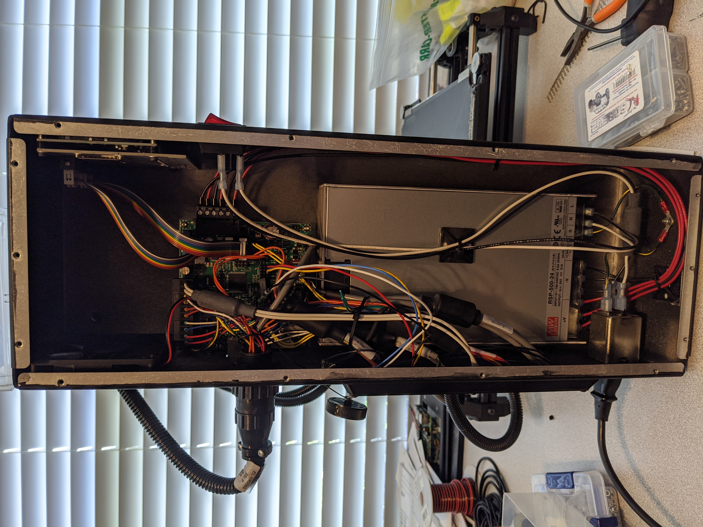
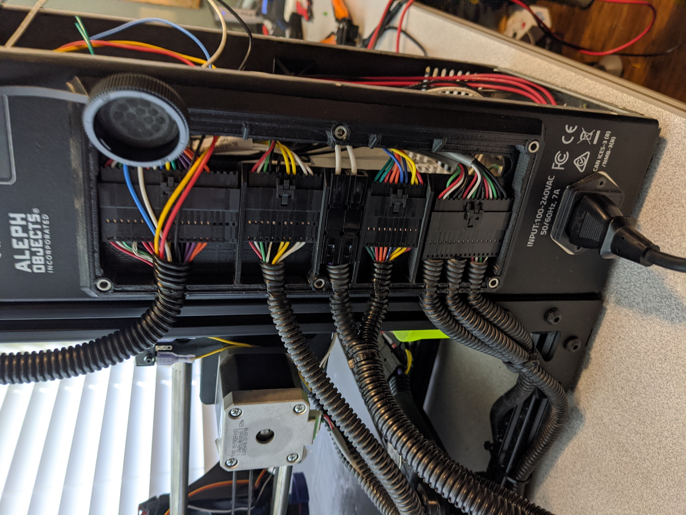
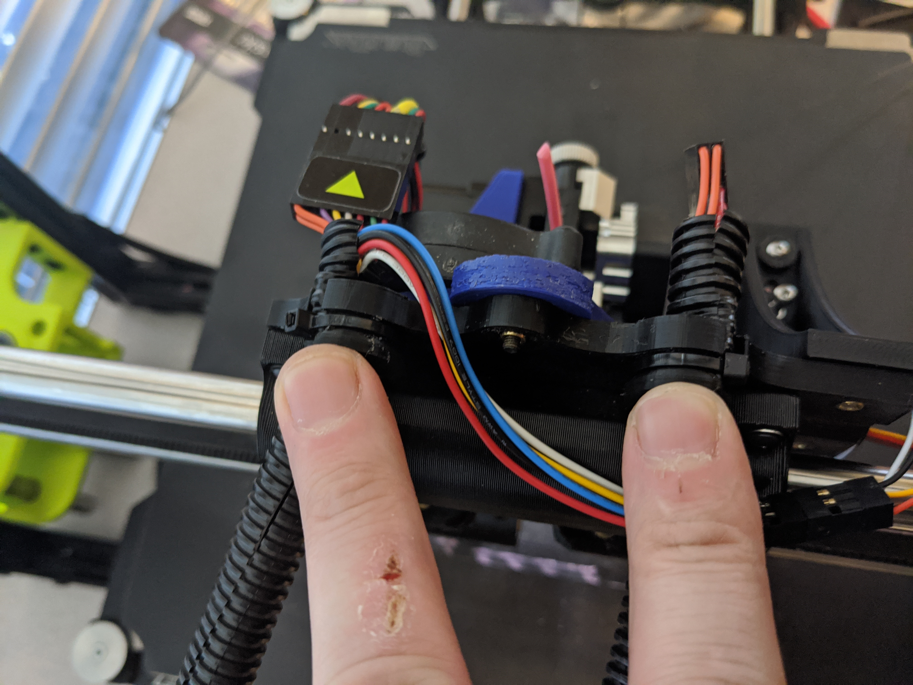

Tutorial - Taz 6 BLTouch with IT-Works 3D print heads
=====================================================

This tutorial will walk through the installation of a BLTouch on a TAZ6
that is using print heads from [IT-Works 3D].

Parts Used
----------

-   1x - [BLTouch]
-   1x - [TAZ 6 Modified X Carriage]
-   1x - [BLTouch calibration spacer 8.3mm]
-   17x - [M3 Heat-Set Inserts]
-   5ft - [22 gauge Black Wire]
-   5ft - [22 gauge White Wire][22 gauge Black Wire]
-   5ft - [22 gauge Red Wire][22 gauge Black Wire]
-   5ft - [22 gauge Brown Wire][22 gauge Black Wire]
-   5ft - [22 gauge Orange Wire][22 gauge Black Wire]
-   2x - [26-24 AWG Heat Shrink butt splices]
-   2x - [M3 30mm Hex Cap Screws]
-   2x - [M3 10mm Screws]
-   4x - [M3 Self locking nut]
-   2x - [2x6 Dupont connectors]
-   5x - [Male Dupont Connectors][2x6 Dupont connectors]
-   [Wire ties]

Remove the print head from the printer

Remove the side cover from the printer

Remove the rear cover from the printer

Cut the wire ties holding the cables to the printer frame.

Cut the wire ties holding the cables to the X Carriage.

Remove the X Carriage.

Use a soldering iron and press the [M3 Heat-Set Inserts] into the [TAZ 6
Modified X Carriage].

M851 X-62 Y-10 M500

G29 P1

  [IT-Works 3D]: https://itworks3d.com/
  [BLTouch]: https://www.amazon.com/gp/product/B07DL48X9L/ref=ppx_yo_dt_b_search_asin_title?ie=UTF8&psc=1
  [TAZ 6 Modified X Carriage]: https://www.thingiverse.com/thing:3512979
  [BLTouch calibration spacer 8.3mm]: https://www.thingiverse.com/thing:2019475
  [M3 Heat-Set Inserts]: https://www.mcmaster.com/94180A333/
  [22 gauge Black Wire]: https://www.amazon.com/gp/product/B00B4ZRPEY/ref=ppx_yo_dt_b_search_asin_title?ie=UTF8&psc=1
  [26-24 AWG Heat Shrink butt splices]: https://www.amazon.com/gp/product/B07G8V35JG/
  [M3 30mm Hex Cap Screws]: https://www.amazon.com/iExcell-Stainless-Socket-Washers-Assortment/dp/B0812TYT5L
  [M3 10mm Screws]: https://www.amazon.com/gp/product/B06Y3JDM4R
  [M3 Self locking nut]: https://www.amazon.com/gp/product/B07FRLRWD4
  [2x6 Dupont connectors]:
  [Wire ties]: https://www.amazon.com/Monday-HS-Plastic-Self-Locking-Electronics-Electrical/dp/B078NT5F2B